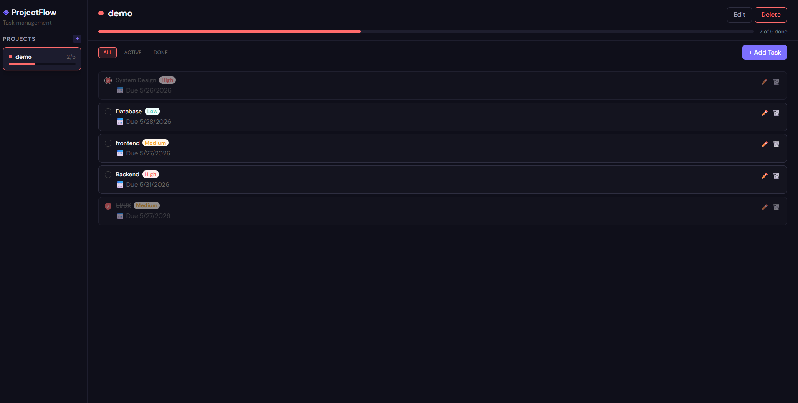
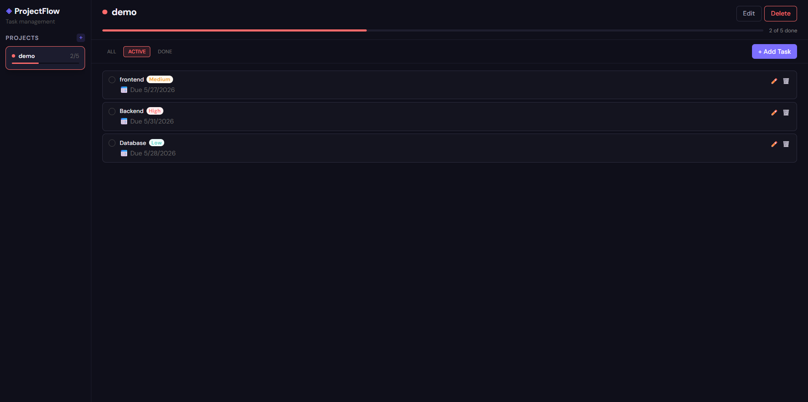
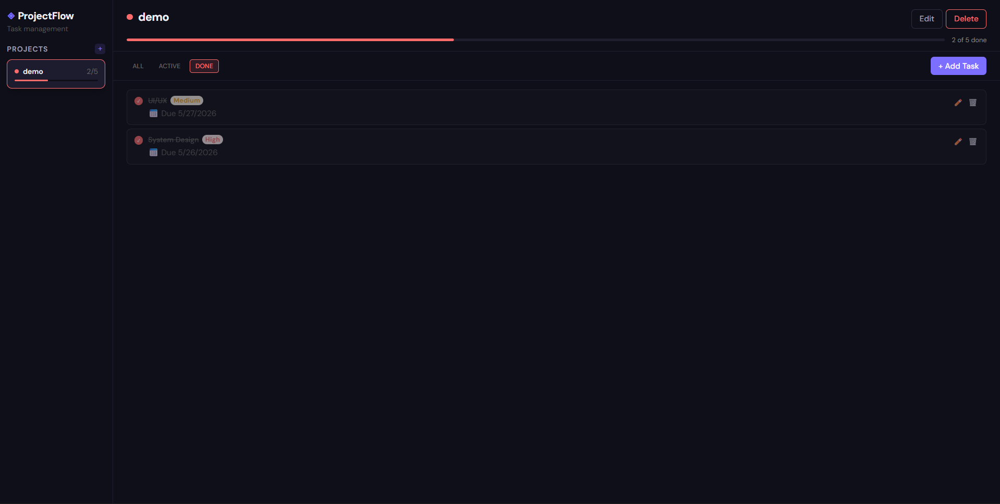

# Todo List Application

A full-stack Todo List web application built with modern technologies for managing daily tasks efficiently.

---

## Features

- User Authentication (Login/Register)
- Create, Update, Delete Todos
- Mark Tasks as Completed
- Responsive UI
- REST API Integration
- MySQL Database Integration
- Modern Frontend Design

---

## Tech Stack

### Frontend
- React.js
- Vite
- HTML5
- CSS3
- JavaScript

### Backend
- Spring Boot
- Java
- REST APIs

### Database
- MySQL

---

# Project Screenshots

## All Tasks


---

## Active Tasks


---

## Completed Tasks


---

## Folder Structure

```text
Todo-List/
│
├── frontend/
├── backend/
├── screenshots/
│   ├── home.png
│   ├── login.png
│   └── dashboard.png
│
├── README.md
└── package.json
```

---

# Installation

## Clone the Repository

```bash
git clone https://github.com/Lakshman464/Todo-List.git
```

---

## Frontend Setup

```bash
cd frontend
npm install
npm run dev
```

---

## Backend Setup

```bash
cd backend
mvn spring-boot:run
```

---

## Database Setup

1. Open MySQL

2. Create database:

```sql
CREATE DATABASE tododb;
```

3. Update database credentials in:

```text
application.properties
```

---

# GitHub Commands

```bash
git add .
git commit -m "Updated README"
git push
```

---

# Author

Lakshman
